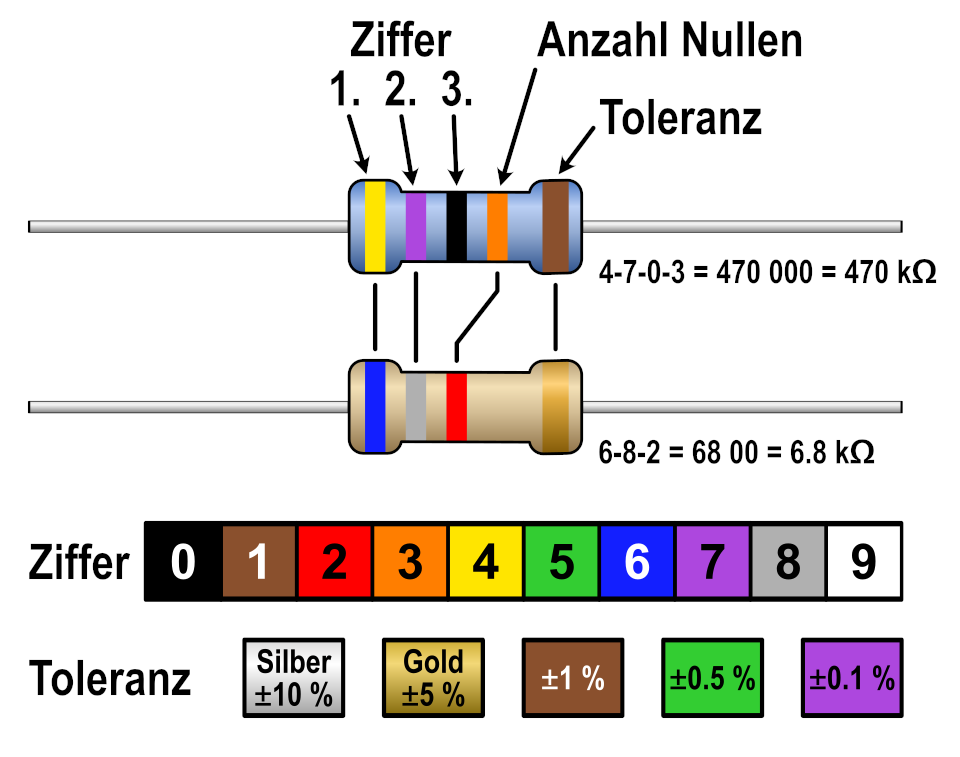
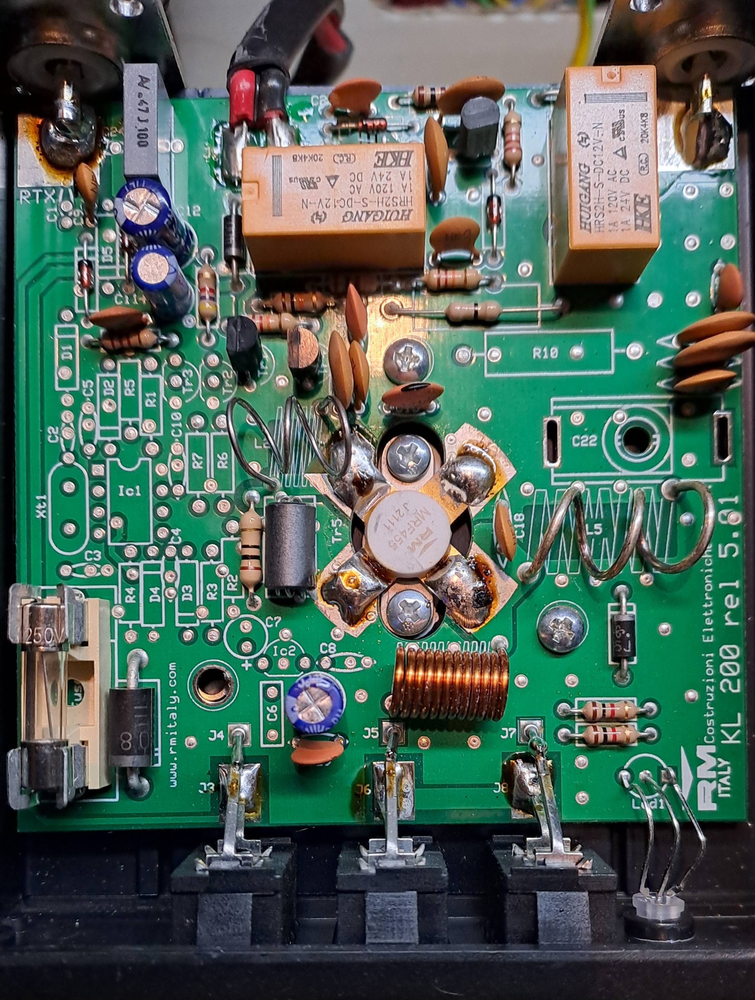
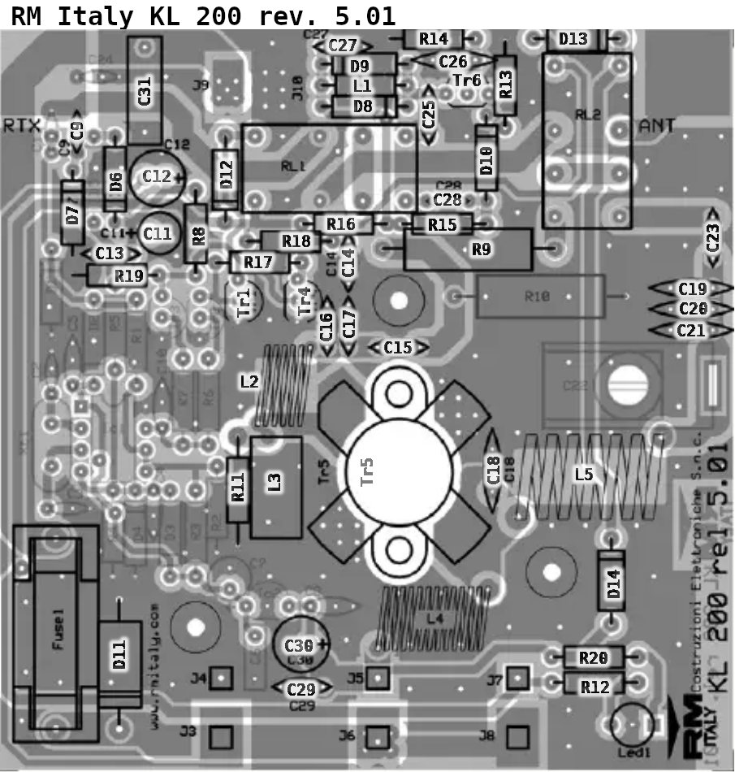
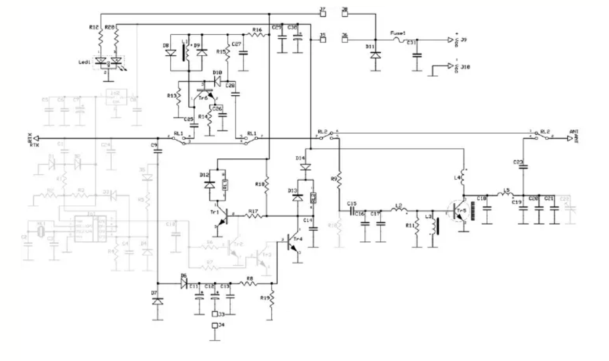

# RM Italy 200-P 455 rev.5.01

Die Schaltung des **RM KL 200/P (Rel. 5.04)** ist ein klassischer, sehr einfach gehaltener Breitband-HF-Verstärker für das 10m/11m-Band (26–30 MHz) in C-Klasse bzw. ungeregeltem AB-Betrieb.

## Warum "Mystery Box"?

Der RM KL 200 wurde im laufe der Zeit so oft verändert ohne dessen Spezifikation anzupassen, dass bei einem Kauf dessen Inhalt so lange ein Mysterium bleibt bis er zum ersten mal geöffnet wird.

### Schaltungsanalyse & Warum der KL 200/P ab Werk oft unsauber klingt

1. **Gleichstrom-Ruhestrom / Bias-Netzwerk:**
* Der KL 200/P arbeitet für den Leistungstransistor (Tr5, hier auf dem Foto ein **MRF455**) mit einer Diode (**D14**, 1N4007) zur Erzeugung einer minimalen Vorspannung.
* **Problem:** Bei vielen Chargen schaltet die Diode den Transistor nicht sauber in den linearen AB-Betrieb, was zu starken IMD-Verzerrungen (Verkratzte Modulation bei SSB/AM) führt. Die Beseitigung alter, gealterter Dioden und Elkos ist daher essentiell.

2. **RF-Kopplung & Filterung (C18–C21, C16–C17):**
* Am Kollektor des Leistungstransistors und im Ausgangsfilter sind hohe HF-Spannungsspitzen und Blindströme wirksam.
* **Problem:** Die ab Werk verbauten günstigen Scheiben-Keramikkondensatoren erhitzen sich stark, driften im Wert oder schlagen durch. Der Austausch gegen verlustarme **Silver-Mica- (Glimmer-) Kondensatoren** bringt hier enorme Stabilität, bessere Auskopplung und verhindert Überhitzung.

3. **HF-Eingangsstufe & Preamp (Tr6):**
* Der HF-Empfangsvorverstärker nutzt Tr6 (BF199). Austausch der gealterten Entkopplungskondensatoren (C25, C26, C28) sorgt für ein deutlich rauschärmeres Signal.

---

### Liste aller Bauteile

| Bauteil | SOLL: Bauteil (Typ / Optimierung) | IST Bauteil | Neupreis €| Link | ... |
| --- | --- | --- | --- | --- | --- |
| **C9** | 8,2 pF / 50V C0G/NP0 Keramik | OK | 0,80 | [DigiKey C9](https://www.digikey.de/de/products/detail/kemet/C315C829D2G5TA/6562375) | |
| **C11** | 4,7 µF / 16V (63V Low-ESR Elko) | OK | 1,50 | [DigiKey C11](https://www.digikey.de/de/products/detail/panasonic-industry/ECQ-E2475KF/56516) | |
| **C12** | 47 µF / 16V (25V Low-ESR Elko) | OK | 0,20 | [DigiKey C12](https://www.digikey.de/de/products/detail/cornell-dubilier-knowles/474CKH100M/5412588)|  |
| **C13** | 100 nF / 50V MKT-Folienkondensator | Kerko 104Z (100nF)| 0,90 |  [DigiKey C13](https://www.digikey.de/de/products/detail/vishay-beyschlag-draloric-bc-components/MKT1817410014/5379271) | |
| **C14** | 10 nF / 50V C0G/X7R Keramik | Kerko 103Z (10nF) | 0,95 | [DigiKey C14](https://www.digikey.de/de/products/detail/kemet/C320C103J5G5TA/14681318) | |
| **C15** | 100 pF / 50V C0G/NP0 Keramik | Kerko 101J (100pF) | 1,85 |  [DigiKey C15](https://www.digikey.de/de/products/detail/kemet/C315C101F5G5TA/6562358) | |
| **C16** | 220 pF / 500V Silver Mica (statt N750) | Kerko NP0 221J (220pF) | 4,40 |  [DigiKey C16](https://www.digikey.de/de/products/detail/cornell-dubilier-knowles/CD15FD271JO3/337850) | |
| **C17** | 270 pF / 500V Silver Mica (statt N750) | Kerko SL 271J (270pF) | 4,40 | [DigiKey C17](https://www.digikey.de/de/products/detail/cornell-dubilier-knowles/CD15FD271JO3/337850) |  |
| **C18** | 120 pF / 500V Silver Mica (High Q) | Kerko NP0 121J (120pF) | 3,15 |  [DigiKey C18](https://www.digikey.de/de/products/detail/cornell-dubilier-knowles/CD15FD121JO3/337846) |  |
| **C19** | 220 pF / 500V Silver Mica (Kollektor) | Kerko NP0 221J (220pF) | 5,20 | [DigiKey C19](https://www.digikey.de/de/products/detail/cornell-dubilier-knowles/CD15FD221FO3F/1917821) | |
| **C20** | 270 pF / 500V Silver Mica (Filter) | Kerko SL 271J (270pF) | 4,40 |  [DigiKey C20](https://www.digikey.de/de/products/detail/cornell-dubilier-knowles/CD15FD271JO3/337850) | |
| **C21** | 120 pF / 500V Silver Mica (Filter) | Kerko NP0 121J (120pF) | 3,15 |  [DigiKey C21](https://www.digikey.de/de/products/detail/cornell-dubilier-knowles/CD15FD121JO3/337846) |  |
| **C23** | 1,0 nF / 500V Keramik (Hochspannung) | Kerko B 102K (1nF) | 0,75 |  [DigiKey C23](https://www.digikey.de/de/products/detail/murata-electronics/RCE7U3A102J2M1H03A/18677969) |  |
| **C25** | 150 pF / 50V C0G/NP0 Keramik | Kerko NP0 151J (150pF) | 0,25 | [DigiKey C25](https://www.digikey.de/de/products/detail/vishay-beyschlag-draloric-bc-components/K151J15C0GF53L2/2820964) | |
| **C26** | 470 pF / 500V Silver Mica (Vorstufe) | Kerko SL 471J (470pF) | 4,15€ |[DigiKey C26](https://www.digikey.de/de/products/detail/cornell-dubilier-knowles/CD19FD471JO3F/1918061) | |
| **C27** | 10 nF / 50V Keramik | Kerko 103Z (10nF) | 0,65 |  [DigiKey C27](https://www.digikey.de/de/products/detail/murata-electronics/RCE5C1H103J1A2H03B/4277596) |  |
| **C28** | 56 pF / 50V C0G/NP0 Keramik | Kerko NP0 56J (56pF) | 0,50 |  [DigiKey C28](https://www.digikey.de/de/products/detail/murata-electronics/RCE5C1H560J0A2H03B/4277662) |  |
| **C29** | 100 nF / 50V MKT-Folienkondensator | Kerko 104Z (100nF) | 0,50 |  [DigiKey C29](https://www.digikey.de/de/products/detail/panasonic-industry/ECQ-E2104JB/2595602) | |
| **C30** | 100 µF / 25V (35V Low-ESR Elko) | OK | 0,25 |  [DigiKey C30](https://www.digikey.de/de/products/detail/kemet/ESY107M025AE3AA/2712544) | |
| **C31** | 470 nF / 100V MKT-Folienkondensator | OK | 0,80 | [DigiKey C31](https://www.digikey.de/de/products/detail/kemet/R60EF3470506AJ/10063837) |  |
| **R8** | 4,7 kΩ / 0,25W Metallschicht 1% | OK | 0,08 |  [Reichelt R8](https://www.reichelt.de/widerstand-metallschicht-4-7-kohm-0204-0-4-w-1--p236963.html) |  |
| **R9** | 15 Ω / 2W Impulsfester Draht/Metalloxid | Fehlt! (0 Ohm Drahtbrücke) | 0,25|  [Reichelt R9](https://www.reichelt.de/drahtwiderstand-axial-3w-15-ohm-5--p277672.html) |  |
| **R11** | 10 Ω / 0,5W Metallschicht 1% | OK | 0,05 | [Reichelt R11](https://www.reichelt.de/duennschichtwiderstand-axial-0-6-w-10-ohm-1--p233671.html) |  |
| **R12** | 1,0 kΩ / 0,25W Metallschicht 1% | OK | 0,60 | [Reichelt R12](https://www.reichelt.de/widerstand-metallschicht-1-0-kohm-axial-0-4-w-1--p237127.html) | |
| **R13** | 2,2 kΩ / 0,25W Metallschicht 1% | OK | 1,30 |[Reichelt R13](https://www.reichelt.de/widerstand-metallschicht-2-2-kohm-axial-0-4-w-1--p237119.html) |  |
| **R14** | 100 Ω / 0,25W Metallschicht 1% | OK | 0,70 | [Reichelt R14](https://www.reichelt.de/widerstand-metallschicht-100-ohm-axial-0-4-w-1--p237128.html) |  |
| **R15** | 12 kΩ / 0,25W Metallschicht 1% | OK | 0,07 | [Reichelt R15](https://www.reichelt.de/widerstand-metallschicht-12-0-kohm-0207-0-6-w-1--p11482.html) | |
| **R16** | 100 Ω / 0,25W Metallschicht 1% | OK | 0,70 | [Reichelt R16](https://www.reichelt.de/widerstand-metallschicht-100-ohm-axial-0-4-w-1--p237128.html) | |
| **R17** | 12 kΩ / 0,25W Metallschicht 1% | OK | 0,07 | [Reichelt R17](https://www.reichelt.de/widerstand-metallschicht-12-0-kohm-0207-0-6-w-1--p11482.html) | |
| **R18** | 10 kΩ / 0,25W Metallschicht 1% | OK | 0,38 | [Reichelt R18](https://www.reichelt.de/widerstand-metallschicht-10-kohm-axial-0-4-w-1--p237126.html) | |
| **R19** | 2,2 kΩ / 0,25W Metallschicht 1% | OK | 0,02| [Reichelt R19](https://www.reichelt.de/widerstand-metallschicht-2-2-kohm-axial-0-4-w-1--p237119.html) |  |
| **R20** | 1,0 kΩ / 0,25W Metallschicht 1% | OK | 0,60 | [Reichelt R20](https://www.reichelt.de/widerstand-metallschicht-1-0-kohm-axial-0-4-w-1--p237127.html) |  |
| **D6-10** | 1N4148 (Fast Switching Diode DO-35) | OK | 0,02 | [Reichelt D6](https://www.reichelt.de/1n4148-do-35-p1730.html) |  |
| **D11** | 1N5400 (3A Power Diode / Schutz) | OK | 1,00 |  [Reichelt D11](https://www.reichelt.de/de/de/shop/produkt/gleichrichterdiode_45_v_10_a_do-201-217019) |  |
| **D12-13** | 1N4007 (1A Standard Rectifier Diode) | OK | 0,02 |  [Reichelt D12](https://www.reichelt.de/1n4007-p1726.html) | |
| **D14** | 1N4007 (Bias-Diode thermisch gekoppelt) | Ok (ohne Kühlung)| 0,02 |  [Reichelt D14](https://www.reichelt.de/1n4007-p1726.html) | |
| **TR1** | BC547B (NPN Universal TO-92) | OK | 0,12 |  [DigiKey TR1](https://www.digikey.de/de/products/detail/diotec-semiconductor/BC547B/13164496) |  |
| **TR4** | BC547B (NPN Universal TO-92) | OK | 0,12 |  [DigiKey TR4](https://www.digikey.de/de/products/detail/diotec-semiconductor/BC547B/13164496) | |
| **TR5** | MRF455 Endstufe Signalausgang | OK |  66€ | - | Original MRF455 nur noch Gebraucht erhältlich |
| **TR6** | BF199 Vorstufe Signaleingang (MPSH10 Ersatz) | OK | 0,250  |  [Reichelt TR6](https://www.reichelt.de/de/de/shop/produkt/hf-bipolartransistor_npn_25v_0_1a_1w_to-92-5433) | Original BF199 nur noch gebraucht erhältlich|

---

### Empfehlungen für den Umbau

1. **Glimmer-Kondensatoren (Silver Mica):**
Ersetze **C16, C17, C18, C19, C20, C21** unbedingt durch die angegebenen Glimmer-Kondensatoren. Sie reduzieren Verlustleistung im Ausgangsnetzwerk extrem und driften bei Erwärmung nicht ab.
2. **Thermische Kopplung von D14:**
Auf dem Foto der Platine sitzt D14 unten rechts am Rand. Achte beim Einbau darauf, dass D14 thermisch nah am Kühlkörper bzw. am Gehäuse des MRF455 anliegt, um ein thermisches Durchgehen des Transistors bei Erwärmung zu verhindern.

---

**Kondensator Kapazität**

| Code | Rechnung | Kapazität in pF | Entspricht in nF / µF |
|-----|-----|-----|-----|
| 100 |  10 × 10⁰ | 10 pF | 0,01 nF |
| 101 |  10 × 10¹ | 100 pF | 0,1 nF |
| 102 |  10 × 10² | 1.000 pF | 1 nF |
| 103 |  10 × 10³ | 10.000 pF | 10 nF |
| 104 |  10 × 10⁴ | 100.000 pF | 100 nF (0,1 µF) |
| 105 |  10 × 10⁵ | 1.000.000 pF | 1.000 nF (1 µF) |
| 22x Beispiel |
| 221 |  22 × 10¹ | 220 pF | 0,22 nF |
| 222 |  22 × 10² | 2.200 pF | 2,2 nF |
| 223 |  22 × 10³ | 22.000 pF | 22 nF |
| 224 |  22 × 10⁴ | 220.000 pF | 220 nF (0,22 µF) |
| | | |
| 2471 |  47 × 10¹ | 470 pF | 0,47 nF |
| 2472 |  47 × 10² | 4.700 pF | 4,7 nF |
| 2473 |  47 × 10³ | 47.000 pF | 47 nF |
| 2474 |  47 × 10⁴ | 470.000 pF | 470 nF (0,47 µF) |

**Kondensator Genauigkeit**

| Buchstabe | Genauigkeit |
| --- | --- |
| C: | ± 0,25 pF |
| D: | ± 0,5 pF |
| F: | ± 1 % |
| G: | ± 2 % |
| J: | ± 5 % |
| K: | ± 10 % |
| M: | ± 20 % |
| Z: | -20% bis +80% |

[Image source](https://de.wikipedia.org/wiki/Datei:Farbcode_von_Widerst%C3%A4nden.svg)

---

## Platine 

## Platine Aufbau

## Schaltung

